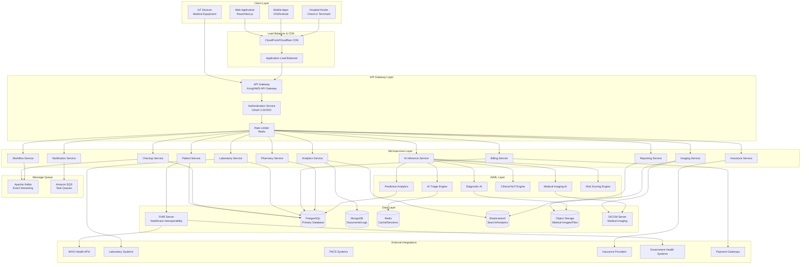
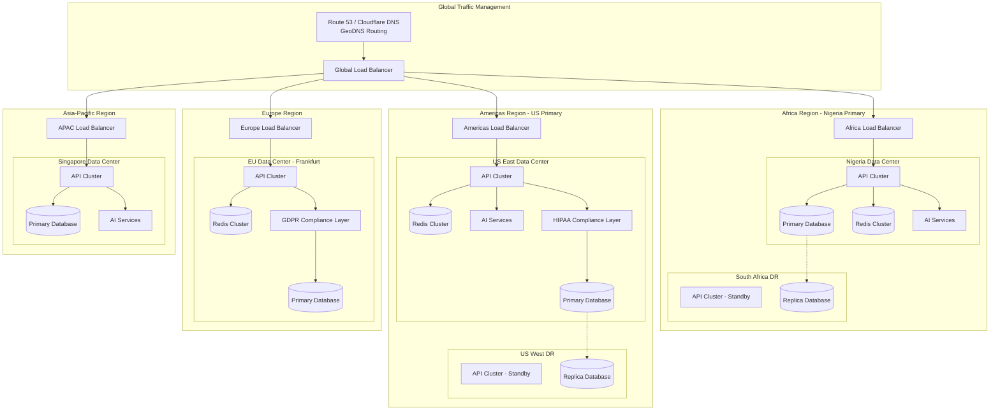
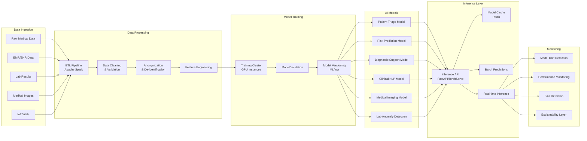
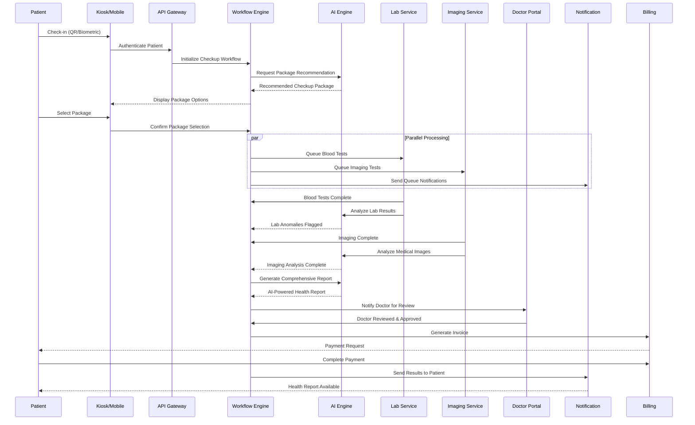
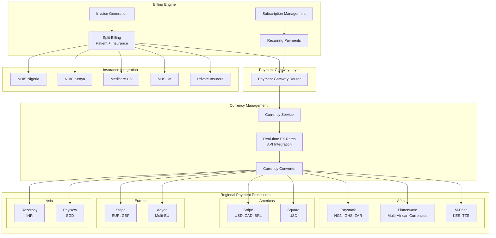
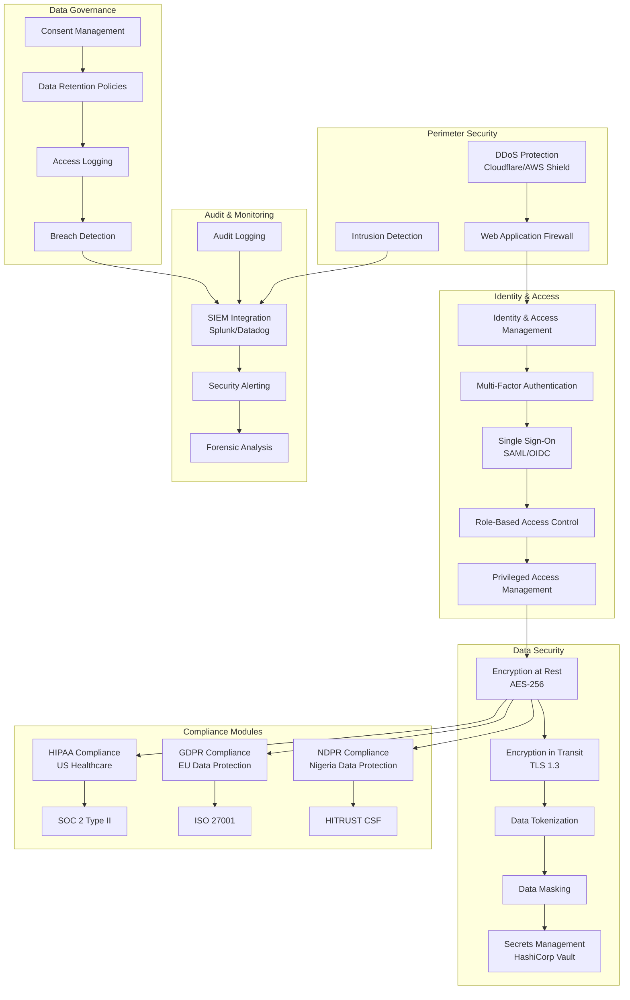
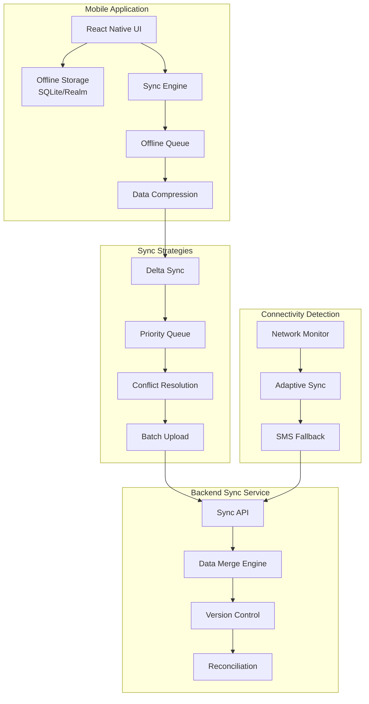

# MediGlobe AI Platform - System Architecture

## Executive Architecture Overview

MediGlobe AI is a multi-tenant, multi-currency, globally distributed healthcare SaaS platform designed to revolutionize preventive healthcare delivery across emerging and developed markets.

---

## High-Level System Architecture

---

## Multi-Region Deployment Architecture

---

## AI/ML Pipeline Architecture

---

## Full Health Checkup Workflow Architecture

---

## Multi-Currency Payment Architecture

---

## Security & Compliance Architecture

---

## Microservices Detail Architecture

```mermaid
graph TB
    subgraph "Patient Service"
        P_API[REST API]
        P_GQL[GraphQL API]
        P_CACHE[Redis Cache]
        P_DB[(Patient DB)]
        P_FHIR[FHIR Patient Resource]
    end

    subgraph "Checkup Service"
        C_API[REST API]
        C_ENGINE[Workflow Engine]
        C_QUEUE[Task Queue]
        C_DB[(Checkup DB)]
        C_SCHED[Scheduler]
    end

    subgraph "Laboratory Service"
        L_API[REST API]
        L_HL7[HL7 Interface]
        L_LIMS[LIMS Integration]
        L_DB[(Lab Results DB)]
        L_AI[AI Lab Analysis]
    end

    subgraph "Imaging Service"
        I_API[REST API]
        I_DICOM[DICOM Interface]
        I_PACS[PACS Integration]
        I_STORE[(Image Storage)]
        I_AI[AI Image Analysis]
    end

    subgraph "Billing Service"
        B_API[REST API]
        B_ENGINE[Billing Engine]
        B_PAY[Payment Gateway]
        B_DB[(Billing DB)]
        B_INS[Insurance Claims]
    end

    subgraph "AI Service"
        AI_API[Inference API]
        AI_TRIAGE[Triage Model]
        AI_RISK[Risk Model]
        AI_DIAG[Diagnostic Model]
        AI_NLP[NLP Engine]
        AI_CV[Computer Vision]
    end

    subgraph "Notification Service"
        N_API[REST API]
        N_SMS[SMS Gateway]
        N_EMAIL[Email Service]
        N_PUSH[Push Notifications]
        N_WHATSAPP[WhatsApp Business]
    end

    subgraph "Analytics Service"
        A_API[REST API]
        A_ETL[ETL Pipeline]
        A_DW[(Data Warehouse)]
        A_BI[BI Dashboard]
        A_ML[ML Analytics]
    end

    P_API --> C_API
    C_ENGINE --> L_API
    C_ENGINE --> I_API
    L_AI --> AI_API
    I_AI --> AI_API
    C_ENGINE --> B_API
    C_ENGINE --> N_API
    AI_API --> A_API
```

---

## Offline-First Mobile Architecture (For Low Connectivity Regions)

---

## Technology Stack Summary

| Layer | Technologies |
|-------|-------------|
| **Frontend** | React, Next.js, React Native, TypeScript, TailwindCSS |
| **API Gateway** | Kong, AWS API Gateway, GraphQL Federation |
| **Backend Services** | Node.js, Python FastAPI, Go, gRPC |
| **AI/ML** | PyTorch, TensorFlow, Hugging Face, OpenCV, Claude AI |
| **Databases** | PostgreSQL, MongoDB, Redis, Elasticsearch |
| **Healthcare Standards** | FHIR R4, HL7v2, DICOM, ICD-10, SNOMED CT, LOINC |
| **Message Queue** | Apache Kafka, RabbitMQ, Amazon SQS |
| **Storage** | AWS S3, Azure Blob, MinIO, DICOM PACS |
| **Monitoring** | Prometheus, Grafana, Datadog, ELK Stack |
| **CI/CD** | GitHub Actions, ArgoCD, Kubernetes, Docker |
| **Security** | HashiCorp Vault, AWS KMS, Cloudflare |

---

## Scalability Metrics

- **Concurrent Users**: 1M+ per region
- **API Requests**: 100K+ requests/second
- **Data Storage**: Petabyte-scale medical imaging
- **Latency**: <100ms for 95th percentile
- **Availability**: 99.99% SLA
- **Recovery Time**: <15 minutes RTO, <1 hour RPO

---

*Document Version: 1.0 | Last Updated: December 2025 | MediGlobe AI Platform*
