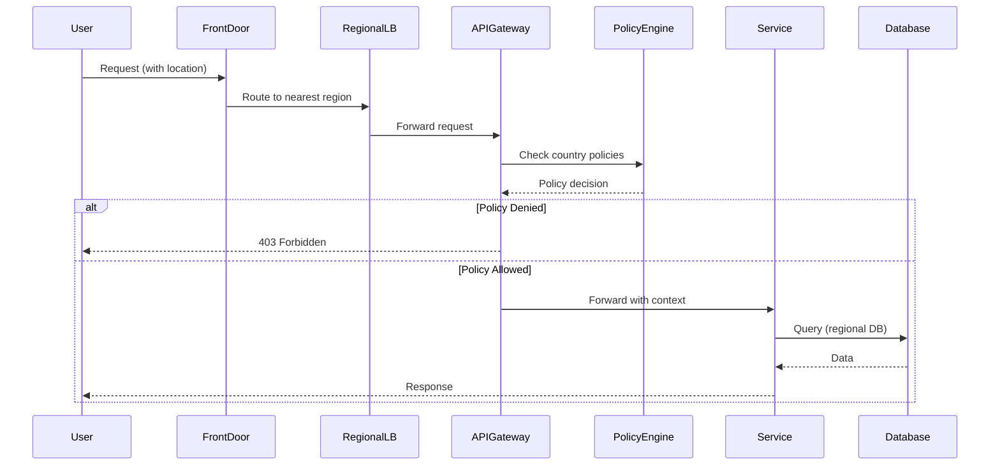

# Global → Region → Country Segmentation Architecture

**World Unified Healthcare Platform - Data Residency & Compliance Architecture**

## Overview

This document describes the three-tier segmentation architecture that enforces data residency, compliance, and feature availability across the global platform.

```
┌─────────────────────────────────────────────────────────────────────────────┐
│                            GLOBAL LAYER                                      │
│  Azure Front Door + WAF │ ACR Geo-Replication │ Global Feature Flags       │
│  Traffic Manager        │ Global Observability │ CI/CD Pipelines            │
│                         (No PHI at this layer)                              │
└─────────────────────────────────────────────────────────────────────────────┘
                                    │
        ┌───────────────────────────┼───────────────────────────┐
        ▼                           ▼                           ▼
┌─────────────────┐       ┌─────────────────┐       ┌─────────────────┐
│   AMERICAS      │       │    EUROPE       │       │    AFRICA       │
│   Region        │       │    Region       │       │    Region       │
│ ─────────────── │       │ ─────────────── │       │ ─────────────── │
│ Location: EUS   │       │ Location: WEU   │       │ Location: SAN   │
│ Compliance:     │       │ Compliance:     │       │ Compliance:     │
│ HIPAA, SOC2     │       │ GDPR, ISO27001  │       │ POPIA, NDPR     │
│ ─────────────── │       │ ─────────────── │       │ ─────────────── │
│ AKS Cluster     │       │ AKS Cluster     │       │ AKS Cluster     │
│ PostgreSQL      │       │ PostgreSQL      │       │ PostgreSQL      │
│ Redis Cache     │       │ Redis Cache     │       │ Redis Cache     │
│ Key Vault       │       │ Key Vault       │       │ Key Vault       │
└────────┬────────┘       └────────┬────────┘       └────────┬────────┘
         │                         │                         │
    ┌────┴────┐               ┌────┴────┐               ┌────┴────┐
    ▼         ▼               ▼         ▼               ▼         ▼
┌──────┐ ┌──────┐       ┌──────┐ ┌──────┐       ┌──────┐ ┌──────┐
│  US  │ │  CA  │       │  DE  │ │  GB  │       │  ZA  │ │  KE  │
│Country│ │Country│      │Country│ │Country│      │Country│ │Country│
└──────┘ └──────┘       └──────┘ └──────┘       └──────┘ └──────┘
```

---

## 1. Global Layer

The global layer provides shared infrastructure that does NOT process or store PHI.

### Components

| Component | Purpose | PHI Allowed |
|-----------|---------|-------------|
| Azure Front Door | Global traffic routing, WAF, DDoS protection | No |
| Traffic Manager | Geographic routing, failover | No |
| ACR Premium | Container image geo-replication | No |
| Global Log Analytics | Routing metrics only | No |
| GitHub Actions | CI/CD pipelines | No |
| Feature Flags | Global feature toggles | No |

### GlobalConfig Schema

```typescript
interface GlobalConfig {
  platformName: string;
  globalFeatures: {
    multiRegion: boolean;
    globalRouting: boolean;
    crossRegionFailover: boolean;
  };
  serviceCatalog: GlobalService[];
  defaultCompliance: string[];
  observability: {
    globalMetrics: boolean;
    routingLogs: boolean;
    alerting: boolean;
  };
  version: string;
}
```

---

## 2. Regional Layer

Each region has independent infrastructure for data residency compliance.

### Americas Region (eastus)

| Attribute | Value |
|-----------|-------|
| Azure Location | East US |
| Compliance | HIPAA, SOC2, ISO27001 |
| Countries | US, CA, MX, BR, AR |
| Currencies | USD, CAD, MXN, BRL, ARS |
| PHI Containment | Regional |
| Backup Regions | eastus, westus2 |

### Europe Region (westeurope)

| Attribute | Value |
|-----------|-------|
| Azure Location | West Europe |
| Compliance | GDPR, ISO27001, SOC2 |
| Countries | DE, FR, GB, IT, ES, NL, BE, AT, CH, SE, NO, DK, FI |
| Currencies | EUR, GBP, CHF, SEK, NOK, DKK |
| PHI Containment | Regional |
| Backup Regions | westeurope, northeurope |

### Africa Region (southafricanorth)

| Attribute | Value |
|-----------|-------|
| Azure Location | South Africa North |
| Compliance | POPIA, NDPR, ISO27001 |
| Countries | ZA, NG, KE, EG, GH, TZ, UG, RW, ET |
| Currencies | ZAR, NGN, KES, EGP, GHS, TZS, UGX, RWF, ETB |
| PHI Containment | Regional |
| Backup Regions | southafricanorth (no cross-region) |

### RegionConfig Schema

```typescript
interface RegionConfig {
  regionId: string;
  name: string;
  azureLocation: string;
  enabled: boolean;
  complianceStandards: string[];
  dataResidency: {
    phiContainment: boolean;
    allowedReplicationRegions: string[];
    crossRegionBackup: boolean;
    keyLocation: 'regional' | 'country';
  };
  infrastructure: {
    aksTier: 'standard' | 'premium';
    postgresqlSku: string;
    redisTier: string;
    highAvailability: boolean;
    minNodes: number;
    maxNodes: number;
  };
  countries: string[];
  supportedCurrencies: string[];
  features: RegionalFeatures;
  peeringConfig?: RegionPeering;
}
```

---

## 3. Country Layer

Countries inherit regional settings and can override with stricter requirements.

### Country Configuration

Each country has a `CountryConfig` that defines:

- **Regulatory Framework**: HIPAA, GDPR, POPIA, etc.
- **Data Residency**: Regional, in-country, or global
- **Allowed Features**: Telehealth, AI, e-prescribing
- **Consent Model**: Opt-in vs opt-out, scopes
- **Retention Periods**: Per data type
- **Audit Requirements**: Events, real-time, immutability
- **Provider Adapters**: EHR, HIE, Lab, Pharmacy
- **Logging Constraints**: PHI redaction rules

### Country Isolation

Countries with strict data residency can enable full isolation:

```typescript
interface CountryIsolation {
  enabled: boolean;
  dedicatedDatabase: boolean;
  dedicatedKeyVault: boolean;
  customerManagedKeys: boolean;
  dedicatedNamespace: boolean;
  dedicatedStorage: boolean;
}
```

**Example: Germany (DE)**

Germany requires strict GDPR compliance with in-country data storage:

```typescript
const GermanyConfig = {
  regionId: 'europe',
  countryCode: 'DE',
  regulatoryFramework: ['GDPR', 'BDSG', 'SGB V', 'eHealth Act'],
  residency: {
    dataLocation: 'in-country',
    allowCrossBorderTransfer: false,
  },
  isolation: {
    enabled: true,
    dedicatedDatabase: true,
    dedicatedKeyVault: true,
    customerManagedKeys: true,
  },
  // ... additional config
};
```

---

## 4. Policy Enforcement

### API Gateway Level

```yaml
# Kong/NGINX routing with country context
routes:
  - path: /api/v1/*
    headers:
      X-Country-Code: required
      X-Region-ID: required
    middleware:
      - country-policy-checker
      - feature-flag-evaluator
      - data-residency-validator
```

### Service Level

Every service validates requests against CountryConfig:

```typescript
async function handleRequest(req: Request) {
  const context = {
    countryCode: req.headers['x-country-code'],
    regionId: req.headers['x-region-id'],
    feature: 'telehealth',
  };

  const policy = await policyEngine.evaluate(context);

  if (!policy.allowed) {
    throw new PolicyViolationError(policy.reason);
  }

  // Proceed with request...
}
```

### Kubernetes Level (OPA Gatekeeper)

```yaml
apiVersion: constraints.gatekeeper.sh/v1beta1
kind: K8sDataResidency
metadata:
  name: require-regional-storage
spec:
  match:
    kinds:
      - apiGroups: [""]
        kinds: ["PersistentVolumeClaim"]
  parameters:
    allowedRegions:
      - "eastus"
      - "westeurope"
      - "southafricanorth"
```

---

## 5. Data Flow

### Request Flow



### Audit Flow

Every policy decision generates an audit event:

```typescript
interface PolicyAuditEvent {
  eventId: string;
  timestamp: Date;
  countryCode: string;
  regionId: string;
  userId: string;
  organizationId: string;
  feature: string;
  allowed: boolean;
  reason: string;
  appliedRules: string[];
}
```

---

## 6. Terraform Structure

```
infrastructure/terraform/
├── global/
│   ├── main.tf           # Front Door, ACR, Traffic Manager
│   ├── variables.tf
│   └── outputs.tf
├── regions/
│   ├── americas/
│   │   ├── main.tf       # AKS, PostgreSQL, Redis, KeyVault
│   │   └── variables.tf
│   ├── europe/
│   │   ├── main.tf
│   │   └── variables.tf
│   └── africa/
│       ├── main.tf
│       └── variables.tf
├── countries/
│   ├── de/               # Germany-specific isolation
│   │   ├── main.tf
│   │   └── variables.tf
│   └── ng/               # Nigeria-specific
│       ├── main.tf
│       └── variables.tf
└── modules/
    ├── region/           # Reusable regional module
    ├── frontdoor/
    ├── country-isolation/
    └── compliance/
```

---

## 7. Compliance Matrix

| Requirement | Americas | Europe | Africa |
|-------------|----------|--------|--------|
| Data Encryption at Rest | AES-256 | AES-256 | AES-256 |
| Data Encryption in Transit | TLS 1.3 | TLS 1.3 | TLS 1.2+ |
| PHI Logging Redaction | Yes | Yes | Yes |
| Cross-Border Transfer | With BAA | With SCC | With consent |
| Breach Notification | 60 days | 72 hours | 72 hours |
| Right of Access | 30 days | 30 days | 21 days |
| Audit Log Retention | 6 years | 10 years | 7 years |
| Data Retention (Records) | 6 years | 10 years | 10 years |

---

## 8. Feature Availability Matrix

| Feature | US | DE | KE |
|---------|----|----|-----|
| Telehealth | Yes | Yes | Yes |
| Video Consultation | Yes | Yes | Yes |
| AI Diagnosis Assist | Yes | No | Yes |
| AI Treatment Suggest | Yes | No | Yes |
| E-Prescribing | Yes | Yes | Yes |
| Controlled Substances | Yes | No | No |
| Lab Integration | Yes | Yes | Yes |
| Mobile Money | No | No | Yes (M-Pesa) |
| USSD Support | No | No | Yes |

---

*Document Version: 1.0*
*Last Updated: December 2024*
