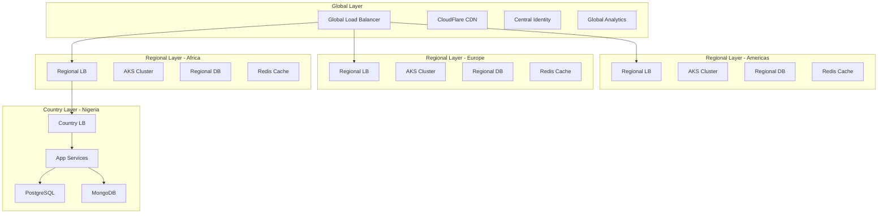
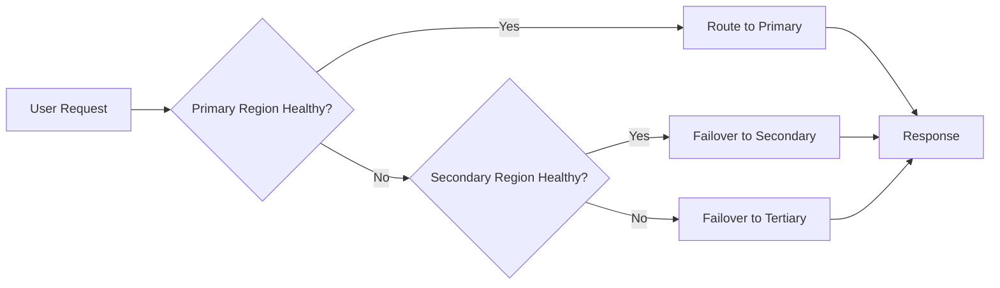

# Global-Region-Country Segmentation Architecture

**Document Version:** 1.0
**Classification:** Technical - Architecture
**Owner:** Platform Engineering
**Last Updated:** December 2024

---

## Table of Contents

1. [Overview](#1-overview)
2. [Multi-Tier Deployment Model](#2-multi-tier-deployment-model)
3. [Global Layer](#3-global-layer)
4. [Regional Layer](#4-regional-layer)
5. [Country Layer](#5-country-layer)
6. [Data Residency & Sovereignty](#6-data-residency--sovereignty)
7. [Network Topology](#7-network-topology)
8. [Deployment Strategy](#8-deployment-strategy)
9. [Failover & Disaster Recovery](#9-failover--disaster-recovery)
10. [Compliance & Legal Considerations](#10-compliance--legal-considerations)

---

## 1. Overview

The UnifiedHealth Global Platform employs a three-tier geographic segmentation model to ensure optimal performance, data sovereignty compliance, and regulatory adherence across diverse global markets.

### 1.1 Architectural Principles

| Principle | Description |
|-----------|-------------|
| **Data Sovereignty** | Patient data stored in-country or in-region per regulations |
| **Low Latency** | Sub-200ms API response times through regional deployment |
| **Regulatory Compliance** | HIPAA, GDPR, NDPR, and local healthcare regulations |
| **Scalability** | Independent scaling per region/country based on demand |
| **High Availability** | 99.95% uptime with multi-AZ deployment |
| **Offline Capability** | Full functionality without internet in remote areas |

### 1.2 Geographic Segmentation Model

```
┌─────────────────────────────────────────────────────────────────────┐
│                        GLOBAL LAYER                                  │
│  - Global Load Balancer (CloudFlare / Route 53)                     │
│  - Global CDN                                                        │
│  - Central Identity Provider (Auth0/Okta)                            │
│  - Global Analytics & Reporting                                      │
│  - Platform Monitoring & Observability                               │
└────────────────────────┬────────────────────────────────────────────┘
                         │
        ┌────────────────┼────────────────┬────────────────┐
        │                │                │                │
        ▼                ▼                ▼                ▼
┌──────────────┐  ┌──────────────┐  ┌──────────────┐  ┌──────────────┐
│   AMERICAS   │  │    EUROPE    │  │    AFRICA    │  │  ASIA-PACIFIC│
│   REGION     │  │    REGION    │  │    REGION    │  │    REGION    │
└──────┬───────┘  └──────┬───────┘  └──────┬───────┘  └──────┬───────┘
       │                 │                 │                 │
  ┌────┴────┐       ┌────┴────┐       ┌────┴────┐       ┌────┴────┐
  │   USA   │       │   UK    │       │ Nigeria │       │Singapore│
  │ Canada  │       │ Germany │       │  Ghana  │       │  India  │
  │ Brazil  │       │ France  │       │  Kenya  │       │Australia│
  │ Mexico  │       │ Ireland │       │ S.Africa│       │   UAE   │
  └─────────┘       └─────────┘       └─────────┘       └─────────┘
    COUNTRY           COUNTRY           COUNTRY           COUNTRY
     LAYER             LAYER             LAYER             LAYER
```

---

## 2. Multi-Tier Deployment Model

### 2.1 Three-Tier Architecture

| Layer | Scope | Responsibilities | Deployment |
|-------|-------|------------------|------------|
| **Global** | Worldwide | Routing, CDN, central auth, analytics | CloudFlare + AWS Route 53 |
| **Regional** | Continent/Region | Regional services, data replication, compliance | AWS/Azure/GCP regional datacenters |
| **Country** | Individual country | Local data storage, country-specific services | In-country or nearest compliant region |

### 2.2 Service Distribution



---

## 3. Global Layer

### 3.1 Components

| Component | Technology | Purpose |
|-----------|-----------|---------|
| **Global Load Balancer** | CloudFlare / AWS Route 53 | Geographic routing, DDoS protection |
| **CDN** | CloudFlare CDN | Static asset delivery, edge caching |
| **Central Identity** | Auth0 / Okta | Global authentication, SSO |
| **Global Analytics** | Snowflake | Cross-region analytics, BI |
| **Monitoring Hub** | Datadog / New Relic | Platform-wide observability |
| **API Gateway** | Kong API Gateway | Global API management |

### 3.2 Global Routing Strategy

**Geo-DNS Routing:**
```
User Request → CloudFlare DNS
  ↓
Determine User Location (GeoIP)
  ↓
Route to Nearest Regional Cluster
  ↓
- Americas → US East (Virginia) / US West (Oregon)
- Europe → EU Central (Frankfurt) / EU West (Dublin)
- Africa → Africa South (Lagos) / Africa South (Johannesburg)
- Asia-Pacific → APAC Southeast (Singapore) / APAC South (Mumbai)
```

### 3.3 Global Services

**Centralized Services:**
- Identity & Access Management (IAM)
- Global user directory
- Certificate management
- API key management
- Global audit logging
- Cross-region analytics
- Platform monitoring dashboards

**Configuration:**
```yaml
global:
  loadBalancer:
    provider: cloudflare
    dnsZone: unifiedhealth.global
    routing: geolocation
    failover: enabled

  cdn:
    provider: cloudflare
    zones:
      - static.unifiedhealth.global
      - assets.unifiedhealth.global
    caching:
      ttl: 3600
      purgeOnDeploy: true

  identity:
    provider: auth0
    domain: auth.unifiedhealth.global
    mfa: required
    sessionTimeout: 3600
```

---

## 4. Regional Layer

### 4.1 Regional Deployment Zones

| Region | Primary DC | DR Site | Countries Served | Latency Target |
|--------|-----------|---------|------------------|----------------|
| **Americas** | US East (Virginia) | US West (Oregon) | USA, Canada, Brazil, Mexico, Caribbean | < 50ms |
| **Europe** | EU Central (Frankfurt) | EU West (Dublin) | UK, Germany, France, Italy, Spain, Nordics | < 50ms |
| **Africa** | Nigeria (Lagos) | South Africa (JHB) | Nigeria, Ghana, Kenya, Tanzania, Uganda | < 100ms |
| **Asia-Pacific** | Singapore | India (Mumbai) | Singapore, India, Australia, Philippines | < 75ms |

### 4.2 Regional Architecture

```
┌──────────────────────────────────────────────────────────────────┐
│                     REGIONAL LAYER (Americas)                     │
├──────────────────────────────────────────────────────────────────┤
│                                                                   │
│  ┌──────────────────┐         ┌──────────────────┐              │
│  │  Regional LB     │────────▶│  AKS Cluster     │              │
│  │  (AWS ALB/NLB)   │         │  (Multi-AZ)      │              │
│  └──────────────────┘         └─────────┬────────┘              │
│                                          │                        │
│  ┌───────────────────────────────────────┼────────────────────┐ │
│  │             MICROSERVICES LAYER       │                    │ │
│  │  ┌──────────┐ ┌──────────┐ ┌──────────┐ ┌──────────┐     │ │
│  │  │ Telehealth│ │  Mental  │ │ Pharmacy │ │Laboratory│     │ │
│  │  │  Service  │ │  Health  │ │  Service │ │  Service │     │ │
│  │  └──────────┘ └──────────┘ └──────────┘ └──────────┘     │ │
│  │  ┌──────────┐ ┌──────────┐ ┌──────────┐ ┌──────────┐     │ │
│  │  │  Imaging  │ │ Chronic  │ │  Billing │ │   Auth   │     │ │
│  │  │  Service  │ │   Care   │ │  Service │ │  Service │     │ │
│  │  └──────────┘ └──────────┘ └──────────┘ └──────────┘     │ │
│  └───────────────────────────────────────────────────────────┘ │
│                                                                   │
│  ┌───────────────────────────────────────────────────────────┐  │
│  │                     DATA LAYER                             │  │
│  │  ┌──────────┐ ┌──────────┐ ┌──────────┐ ┌──────────┐     │  │
│  │  │PostgreSQL│ │ MongoDB  │ │  Redis   │ │Elasticsearch│  │  │
│  │  │(Primary) │ │  (PHI)   │ │ (Cache)  │ │  (Search)  │  │  │
│  │  │Multi-AZ  │ │ Replica  │ │ Cluster  │ │  Cluster   │  │  │
│  │  └──────────┘ └──────────┘ └──────────┘ └──────────┘     │  │
│  └───────────────────────────────────────────────────────────┘  │
│                                                                   │
│  ┌───────────────────────────────────────────────────────────┐  │
│  │                  STORAGE LAYER                             │  │
│  │  ┌──────────┐ ┌──────────┐ ┌──────────┐                   │  │
│  │  │  S3 /    │ │   PACS   │ │  Backup  │                   │  │
│  │  │Azure Blob│ │ (Imaging)│ │  Vault   │                   │  │
│  │  └──────────┘ └──────────┘ └──────────┘                   │  │
│  └───────────────────────────────────────────────────────────┘  │
│                                                                   │
└──────────────────────────────────────────────────────────────────┘
```

### 4.3 Regional Service Configuration

**Kubernetes Cluster Specification:**
```yaml
region: us-east-1
cluster:
  name: unifiedhealth-americas-prod
  version: 1.28
  nodeGroups:
    - name: system
      instanceType: t3.large
      minSize: 2
      maxSize: 5
      zones: [us-east-1a, us-east-1b, us-east-1c]

    - name: application
      instanceType: t3.xlarge
      minSize: 5
      maxSize: 50
      zones: [us-east-1a, us-east-1b, us-east-1c]
      autoscaling:
        enabled: true
        targetCPU: 70
        targetMemory: 80

    - name: data-intensive
      instanceType: r5.2xlarge
      minSize: 2
      maxSize: 10
      zones: [us-east-1a, us-east-1b, us-east-1c]

  networking:
    vpcCIDR: 10.0.0.0/16
    podCIDR: 100.64.0.0/16
    serviceCIDR: 172.20.0.0/16
```

### 4.4 Regional Data Replication

**Database Replication Strategy:**

| Database | Replication Type | RPO | RTO |
|----------|-----------------|-----|-----|
| PostgreSQL | Streaming Replication (Async) | < 5 min | < 30 min |
| MongoDB | Replica Set (Multi-Region) | < 1 min | < 15 min |
| Redis | Sentinel + Clustering | < 1 min | < 5 min |
| Elasticsearch | Cross-cluster replication | < 5 min | < 30 min |

---

## 5. Country Layer

### 5.1 Country-Specific Deployment

**Deployment Models:**

| Model | Use Case | Countries | Architecture |
|-------|----------|-----------|--------------|
| **Full Stack** | Data sovereignty required | Nigeria, India, China | Complete infrastructure in-country |
| **Edge Nodes** | Performance optimization | Kenya, Ghana, UAE | Edge compute + regional data |
| **Regional Only** | No local requirements | USA, UK, Germany | Served from regional cluster |

### 5.2 Nigeria Country Layer Example

```
┌────────────────────────────────────────────────────────────────┐
│              NIGERIA COUNTRY LAYER (Lagos)                      │
├────────────────────────────────────────────────────────────────┤
│                                                                 │
│  ┌──────────────┐          ┌──────────────┐                   │
│  │  Country LB  │─────────▶│  AKS/ACS     │                   │
│  │  (Nginx)     │          │  Cluster     │                   │
│  └──────────────┘          └──────┬───────┘                   │
│                                    │                            │
│  ┌────────────────────────────────┼──────────────────────────┐│
│  │          NIGERIA-SPECIFIC SERVICES                        ││
│  │  ┌──────────┐ ┌──────────┐ ┌──────────┐ ┌──────────┐    ││
│  │  │   NHIS   │ │  Naira   │ │ Hausa/   │ │Local Lab │    ││
│  │  │Integration│ │ Billing  │ │ Yoruba   │ │Partners  │    ││
│  │  │          │ │ (NGN)    │ │   i18n   │ │          │    ││
│  │  └──────────┘ └──────────┘ └──────────┘ └──────────┘    ││
│  └──────────────────────────────────────────────────────────┘│
│                                                                 │
│  ┌──────────────────────────────────────────────────────────┐ │
│  │          NIGERIAN DATA STORAGE (NDPR Compliant)          │ │
│  │  ┌──────────┐ ┌──────────┐ ┌──────────┐                 │ │
│  │  │PostgreSQL│ │ MongoDB  │ │  Redis   │                 │ │
│  │  │ (Lagos)  │ │ (Lagos)  │ │ (Lagos)  │                 │ │
│  │  │  Local   │ │  Local   │ │  Local   │                 │ │
│  │  └──────────┘ └──────────┘ └──────────┘                 │ │
│  └──────────────────────────────────────────────────────────┘ │
│                                                                 │
│  ┌──────────────────────────────────────────────────────────┐ │
│  │          LOCAL INTEGRATIONS                               │ │
│  │  - NHIS (National Health Insurance Scheme)               │ │
│  │  - Paystack / Flutterwave (Payment Processors)           │ │
│  │  - Nigerian hospitals & diagnostic centers               │ │
│  │  - Local pharmacy networks                               │ │
│  └──────────────────────────────────────────────────────────┘ │
│                                                                 │
└────────────────────────────────────────────────────────────────┘
```

### 5.3 Country-Specific Services

**Service Customization Matrix:**

| Country | Currency | Language | Payment Gateway | Insurance | Health ID |
|---------|----------|----------|-----------------|-----------|-----------|
| **Nigeria** | NGN | English, Hausa, Yoruba, Igbo | Paystack, Flutterwave | NHIS | National ID |
| **Kenya** | KES | English, Swahili | M-Pesa, Paystack | NHIF | Huduma Number |
| **Ghana** | GHS | English, Twi, Ga | Paystack, MTN Mobile Money | NHIS | Ghana Card |
| **USA** | USD | English, Spanish | Stripe | Medicare, Medicaid, Private | SSN |
| **UK** | GBP | English | Stripe | NHS | NHS Number |
| **India** | INR | English, Hindi, regional | Razorpay, Paytm | PMJAY, ESI | Aadhaar |

### 5.4 Country Layer Configuration

```yaml
country: nigeria
code: NG
region: africa

deployment:
  location: lagos
  provider: azure
  resourceGroup: unifiedhealth-nigeria-prod

services:
  - telehealth
  - mental-health
  - pharmacy
  - laboratory
  - imaging
  - chronic-care

localization:
  defaultLanguage: en
  supportedLanguages:
    - en (English)
    - ha (Hausa)
    - yo (Yoruba)
    - ig (Igbo)

  currency: NGN
  timezone: Africa/Lagos
  dateFormat: DD/MM/YYYY

payment:
  processors:
    - paystack
    - flutterwave
  currencies:
    - NGN

insurance:
  providers:
    - nhis
    - axa-mansard
    - leadway
    - hygeia

compliance:
  regulations:
    - NDPR (Nigeria Data Protection Regulation)
    - NHIS Guidelines
    - NAFDAC Requirements

  dataResidency:
    required: true
    location: nigeria
    backupLocation: south-africa
```

---

## 6. Data Residency & Sovereignty

### 6.1 Data Classification

| Data Type | Storage Location | Replication | Compliance |
|-----------|------------------|-------------|------------|
| **PHI (Personal Health Information)** | Country-specific or regional | Encrypted replication within region | HIPAA, GDPR, NDPR |
| **User Credentials** | Global (encrypted) | Multi-region | All regulations |
| **Transaction Data** | Country-specific | Regional backup | Financial regulations |
| **Analytics (De-identified)** | Global data lake | Global | GDPR anonymization |
| **Audit Logs** | Country + Regional | Immutable, long-term | HIPAA, GDPR |

### 6.2 Data Flow Diagram

```
┌──────────────────────────────────────────────────────────────────┐
│                      DATA FLOW BY TYPE                            │
└──────────────────────────────────────────────────────────────────┘

PHI Data:
  User (Nigeria) → Nigeria Cluster → Nigeria PostgreSQL/MongoDB
                → Encrypted Backup → South Africa DR Site
                → De-identified Analytics → Global Snowflake

User Authentication:
  User (Any Location) → Global Auth0 → Regional Token Cache
                      → Local Session Management

Billing Data:
  User (Nigeria) → Nigeria Billing Service → Nigeria DB
               → Transaction Processor (Paystack)
               → Regional Analytics

Medical Imaging:
  User (Kenya) → Kenya Imaging Service → Kenya PACS Server
             → Regional CDN Cache
             → Optional: Regional Backup
```

### 6.3 Cross-Border Data Transfer

**Transfer Mechanisms:**

| Source Region | Destination Region | Mechanism | Legal Basis |
|---------------|-------------------|-----------|-------------|
| EU → US | GDPR → HIPAA | Standard Contractual Clauses (SCCs) | Adequacy decision |
| Nigeria → EU | NDPR → GDPR | Data Processing Agreement | Consent + Legitimate interest |
| US → APAC | HIPAA → Local | Business Associate Agreement | HIPAA compliance |
| Any → Global Analytics | Local → Snowflake | De-identification + Encryption | Anonymized data exemption |

---

## 7. Network Topology

### 7.1 Network Architecture

```
                         ┌─────────────────┐
                         │  CloudFlare     │
                         │  Global CDN     │
                         └────────┬────────┘
                                  │
                    ┌─────────────┼─────────────┐
                    │             │             │
            ┌───────▼──────┐ ┌───▼──────┐ ┌───▼──────┐
            │  Americas    │ │  Europe  │ │  Africa  │
            │  VPC         │ │  VNet    │ │  VPC     │
            │ 10.0.0.0/16  │ │10.1.0.0/16│ │10.2.0.0/16│
            └───────┬──────┘ └───┬──────┘ └───┬──────┘
                    │            │            │
        ┌───────────┼────────────┼────────────┼───────────┐
        │           │            │            │           │
   ┌────▼────┐ ┌───▼────┐  ┌───▼────┐  ┌───▼────┐ ┌────▼────┐
   │ Public  │ │Private │  │Database│  │ Private│ │ Public  │
   │ Subnet  │ │ Subnet │  │ Subnet │  │Link/VPN│ │ Subnet  │
   └─────────┘ └────────┘  └────────┘  └────────┘ └─────────┘
```

### 7.2 Network Segmentation

| Tier | CIDR Block | Components | Access Control |
|------|-----------|------------|----------------|
| **Public Subnet** | x.x.1.0/24 | Load balancers, NAT gateways | Internet-facing |
| **Private Subnet** | x.x.2-5.0/24 | Application pods, microservices | Internal only |
| **Database Subnet** | x.x.10.0/24 | PostgreSQL, MongoDB, Redis | Application tier only |
| **Management Subnet** | x.x.100.0/24 | Bastion hosts, monitoring | VPN/IP whitelist |

### 7.3 Inter-Region Connectivity

**Connection Methods:**

| Method | Use Case | Bandwidth | Latency |
|--------|----------|-----------|---------|
| **VPN Tunnels** | Management, DR replication | 1-10 Gbps | Variable |
| **AWS Transit Gateway** | Americas inter-region | 50 Gbps | < 10ms |
| **Azure ExpressRoute** | Europe-Africa | 10 Gbps | < 50ms |
| **CloudFlare Argo** | Global edge routing | Dynamic | Optimized |

---

## 8. Deployment Strategy

### 8.1 Phased Rollout

**Phase 1: Americas & Core Markets (Months 1-12)**
```
Regions: US East, US West
Countries: USA, Canada
Services: All MVP services
Infrastructure: Full AKS deployment
```

**Phase 2: Africa & Europe Expansion (Months 13-24)**
```
Regions: EU Central, Africa South
Countries: UK, Germany, Nigeria, Kenya, Ghana
Services: All MVP + Phase 2 services
Infrastructure: Regional clusters + country layers
```

**Phase 3: Global Scale (Months 25-36)**
```
Regions: APAC (Singapore, Mumbai)
Countries: India, Singapore, Australia, UAE
Services: Full platform
Infrastructure: Global mesh with country-specific nodes
```

### 8.2 Deployment Configuration

**Terraform Workspace Structure:**
```
infrastructure/
├── global/
│   ├── cloudflare.tf
│   ├── route53.tf
│   └── auth0.tf
├── regional/
│   ├── americas/
│   │   ├── us-east-1/
│   │   └── us-west-2/
│   ├── europe/
│   │   ├── eu-central-1/
│   │   └── eu-west-1/
│   ├── africa/
│   │   ├── af-south-1/
│   │   └── custom-nigeria/
│   └── apac/
│       ├── ap-southeast-1/
│       └── ap-south-1/
└── country/
    ├── nigeria/
    ├── kenya/
    ├── india/
    └── ...
```

---

## 9. Failover & Disaster Recovery

### 9.1 Multi-Region Failover

**Failover Strategy:**



### 9.2 Recovery Objectives

| Service Tier | RTO (Recovery Time Objective) | RPO (Recovery Point Objective) |
|--------------|------------------------------|--------------------------------|
| **Critical Services** (Auth, Core APIs) | < 1 hour | < 5 minutes |
| **Standard Services** (Appointments, EHR) | < 4 hours | < 1 hour |
| **Analytics & Reporting** | < 24 hours | < 24 hours |

### 9.3 DR Testing Schedule

| Test Type | Frequency | Scope |
|-----------|-----------|-------|
| **Failover Drill** | Quarterly | Full regional failover |
| **Data Restore** | Monthly | Database point-in-time recovery |
| **Chaos Engineering** | Bi-weekly | Random service disruption |
| **Tabletop Exercise** | Quarterly | Incident response procedures |

---

## 10. Compliance & Legal Considerations

### 10.1 Regional Compliance Matrix

| Region | Primary Regulations | Data Residency | Cross-Border Transfer | Audit Requirements |
|--------|-------------------|----------------|----------------------|-------------------|
| **Americas** | HIPAA, HITECH, State laws | Flexible | BAA required | Annual HIPAA audit |
| **Europe** | GDPR, ePrivacy, MDR | EU-only or SCCs | SCCs, adequacy decision | GDPR DPO, DPIA |
| **Africa** | NDPR, POPIA, local laws | In-country preferred | Consent + DPA | NDPR compliance audit |
| **APAC** | PDPA, DPDP, local laws | Varies by country | Case-by-case | Local audits |

### 10.2 Legal Entity Structure

```
UnifiedHealth Global Holdings (Delaware, USA)
├── UnifiedHealth Inc. (USA) - Americas operations
├── UnifiedHealth Europe GmbH (Germany) - EU operations
├── UnifiedHealth UK Ltd. (United Kingdom) - UK operations
├── UnifiedHealth Nigeria Ltd. (Nigeria) - West Africa operations
├── UnifiedHealth Kenya Ltd. (Kenya) - East Africa operations
├── UnifiedHealth India Pvt. Ltd. (India) - India operations
├── UnifiedHealth Singapore Pte. Ltd. (Singapore) - APAC operations
└── UnifiedHealth IP Holdings (Ireland) - Intellectual property
```

### 10.3 Data Processing Agreements

**Required Agreements:**

| Agreement Type | Parties | Purpose | Renewal |
|---------------|---------|---------|---------|
| **BAA (Business Associate Agreement)** | UnifiedHealth ↔ US healthcare providers | HIPAA compliance | Annual |
| **DPA (Data Processing Agreement)** | UnifiedHealth ↔ EU customers | GDPR compliance | 3 years |
| **SCCs (Standard Contractual Clauses)** | UnifiedHealth entities | Cross-border transfer | Per transfer |
| **Local Compliance Agreements** | UnifiedHealth ↔ country-specific partners | Local regulations | Annual |

---

## Appendix A: Regional Deployment Checklist

### Pre-Deployment
- [ ] Legal entity established in target country
- [ ] Data residency requirements documented
- [ ] Compliance certifications obtained
- [ ] Network infrastructure provisioned
- [ ] Cloud provider accounts created
- [ ] DNS zones configured

### Deployment
- [ ] Terraform infrastructure deployed
- [ ] Kubernetes cluster provisioned
- [ ] Database instances created
- [ ] Data encrypted at rest and in transit
- [ ] Network policies configured
- [ ] Load balancers configured
- [ ] CDN zones created

### Post-Deployment
- [ ] Health checks passing
- [ ] Monitoring alerts configured
- [ ] Backup jobs scheduled
- [ ] DR procedures tested
- [ ] Compliance audit completed
- [ ] Documentation updated

---

## Appendix B: Network Latency Targets

| Source Region | Target Region | Latency Target | Current P95 |
|---------------|---------------|----------------|-------------|
| US East → US West | Americas | < 70ms | 65ms |
| US East → EU Central | Trans-Atlantic | < 100ms | 95ms |
| EU Central → Africa South | EU-Africa | < 150ms | 140ms |
| Africa South → APAC | Africa-Asia | < 200ms | 185ms |
| APAC → Americas | Trans-Pacific | < 200ms | 190ms |

---

## Appendix C: Cost Optimization Strategies

1. **Regional Data Tiering**: Hot data in-region, warm data in lower-cost regions
2. **Edge Caching**: 80%+ cache hit rate reduces origin load
3. **Auto-scaling**: Scale down non-business hours (30-50% cost savings)
4. **Reserved Instances**: 40-60% savings for baseline capacity
5. **Cross-Region Replication**: Only for critical data (PHI, audit logs)
6. **Data Lifecycle Policies**: Archive old data to S3 Glacier/Azure Cool Blob

---

*Document Version: 1.0*
*Last Updated: December 2024*
*Owner: Platform Engineering*
