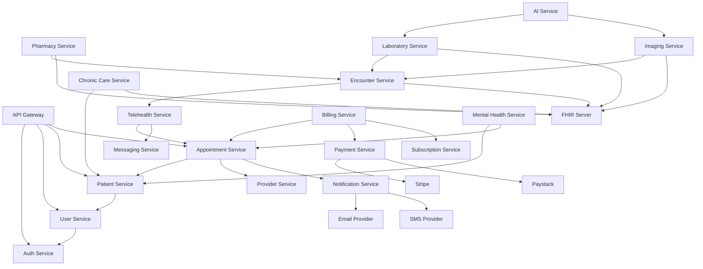

# Microservices Architecture Map

**Document Version:** 1.0
**Classification:** Technical - Architecture
**Owner:** Platform Engineering
**Last Updated:** December 2024

---

## Table of Contents

1. [Overview](#1-overview)
2. [Service Inventory](#2-service-inventory)
3. [Service Categories](#3-service-categories)
4. [Inter-Service Communication](#4-inter-service-communication)
5. [Data Flow Patterns](#5-data-flow-patterns)
6. [Service Dependencies](#6-service-dependencies)
7. [API Gateway Routing](#7-api-gateway-routing)
8. [Event-Driven Architecture](#8-event-driven-architecture)
9. [Service Mesh Configuration](#9-service-mesh-configuration)
10. [Deployment Topology](#10-deployment-topology)

---

## 1. Overview

The UnifiedHealth Platform is built on a microservices architecture with 25+ services organized into domain-driven bounded contexts. Each service is independently deployable, scalable, and maintainable.

### 1.1 Architectural Principles

| Principle | Implementation |
|-----------|----------------|
| **Domain-Driven Design** | Services aligned with business domains |
| **Single Responsibility** | Each service owns a specific capability |
| **Loose Coupling** | Services communicate via APIs and events |
| **High Cohesion** | Related functionality grouped together |
| **API-First** | OpenAPI specifications drive development |
| **Event-Driven** | Asynchronous communication for scalability |
| **Resilience** | Circuit breakers, retries, fallbacks |
| **Observability** | Distributed tracing, metrics, logs |

### 1.2 Service Architecture Diagram

```
┌────────────────────────────────────────────────────────────────────────────┐
│                       UNIFIEDHEALTH MICROSERVICES MAP                       │
└────────────────────────────────────────────────────────────────────────────┘

┌────────────────────────────────────────────────────────────────────────────┐
│                            CLIENT LAYER                                     │
├─────────────┬─────────────┬─────────────┬─────────────┬────────────────────┤
│   Web App   │  Mobile App │ Provider UI │  Admin UI   │  Third-Party APIs  │
│  (Next.js)  │ (RN/Expo)   │  (Next.js)  │  (Next.js)  │  (REST/GraphQL)    │
└──────┬──────┴──────┬──────┴──────┬──────┴──────┬──────┴──────┬─────────────┘
       │             │             │             │             │
       └─────────────┴─────────────┴─────────────┴─────────────┘
                                   │
                                   ▼
┌────────────────────────────────────────────────────────────────────────────┐
│                         API GATEWAY LAYER                                   │
├────────────────────────────────────────────────────────────────────────────┤
│  ┌──────────────────────────────────────────────────────────────────────┐ │
│  │               Kong API Gateway / GraphQL Federation                   │ │
│  │  - Authentication & Authorization                                     │ │
│  │  - Rate Limiting & Throttling                                         │ │
│  │  - Request/Response Transformation                                    │ │
│  │  - API Versioning (/v1, /v2)                                          │ │
│  │  - Circuit Breaking & Fallback                                        │ │
│  └──────────────────────────────────────────────────────────────────────┘ │
└────────────────────────────────────────────────────────────────────────────┘
                                   │
       ┌───────────────────────────┼───────────────────────────┐
       │                           │                           │
       ▼                           ▼                           ▼
┌─────────────────┐    ┌─────────────────────┐    ┌──────────────────────┐
│   CORE DOMAIN   │    │   HEALTH DATA       │    │  SPECIALTY SERVICES  │
│    SERVICES     │    │     SERVICES        │    │                      │
└─────────────────┘    └─────────────────────┘    └──────────────────────┘
```

---

## 2. Service Inventory

### 2.1 Complete Service Catalog

| Service Name | Technology | Port | Database | MVP/Phase 2 | Status |
|--------------|-----------|------|----------|-------------|--------|
| **api-gateway** | Node.js/Bun | 8080 | Redis | MVP | Active |
| **auth-service** | Node.js | 3001 | PostgreSQL, Redis | MVP | Active |
| **user-service** | Node.js | 3002 | PostgreSQL | MVP | Active |
| **patient-service** | Node.js | 3003 | PostgreSQL, MongoDB | MVP | Active |
| **provider-service** | Node.js | 3004 | PostgreSQL | MVP | Active |
| **appointment-service** | Node.js | 3005 | PostgreSQL, Redis | MVP | Active |
| **telehealth-service** | Node.js | 3006 | PostgreSQL, MongoDB | MVP | Active |
| **encounter-service** | Node.js | 3007 | PostgreSQL, MongoDB | MVP | Active |
| **document-service** | Python/FastAPI | 3008 | MongoDB, S3 | MVP | Active |
| **fhir-server** | Java/HAPI | 8090 | PostgreSQL | MVP | Active |
| **mental-health-service** | Node.js | 3010 | PostgreSQL, MongoDB | MVP | Active |
| **pharmacy-service** | Node.js | 3011 | PostgreSQL | MVP | Active |
| **laboratory-service** | Node.js | 3012 | PostgreSQL, MongoDB | MVP | Active |
| **imaging-service** | Python/FastAPI | 3013 | PostgreSQL, PACS | MVP | Active |
| **chronic-care-service** | Python/FastAPI | 3014 | PostgreSQL, MongoDB | MVP | Active |
| **billing-service** | Node.js | 3015 | PostgreSQL | MVP | Active |
| **payment-service** | Node.js | 3016 | PostgreSQL | MVP | Active |
| **subscription-service** | Node.js | 3017 | PostgreSQL | MVP | Active |
| **notification-service** | Node.js | 3018 | PostgreSQL, Redis | MVP | Active |
| **messaging-service** | Node.js | 3019 | MongoDB, Redis | MVP | Active |
| **ai-service** | Python/FastAPI | 3020 | PostgreSQL | Phase 2 | Active |
| **analytics-service** | Python | 3021 | PostgreSQL, Snowflake | Phase 2 | Active |
| **search-service** | Go | 3022 | Elasticsearch | MVP | Active |
| **audit-service** | Go | 3023 | PostgreSQL | MVP | Active |
| **consent-service** | Node.js | 3024 | PostgreSQL | MVP | Active |

---

## 3. Service Categories

### 3.1 Core Clinical Domain

```
┌───────────────────────────────────────────────────────────────────┐
│                    CORE CLINICAL SERVICES                          │
├───────────────────────────────────────────────────────────────────┤
│                                                                    │
│  ┌────────────────┐  ┌────────────────┐  ┌────────────────┐     │
│  │  Telehealth    │  │  Appointment   │  │   Provider     │     │
│  │   Service      │  │    Service     │  │   Service      │     │
│  │                │  │                │  │                │     │
│  │ - Video calls  │  │ - Scheduling   │  │ - Credentials  │     │
│  │ - Audio calls  │  │ - Calendar     │  │ - Availability │     │
│  │ - Chat         │  │ - Reminders    │  │ - Specialties  │     │
│  │ - Recording    │  │ - Waitlist     │  │ - Ratings      │     │
│  └────────────────┘  └────────────────┘  └────────────────┘     │
│                                                                    │
│  ┌────────────────┐  ┌────────────────┐  ┌────────────────┐     │
│  │   Encounter    │  │   Messaging    │  │   Patient      │     │
│  │    Service     │  │    Service     │  │   Service      │     │
│  │                │  │                │  │                │     │
│  │ - Clinical     │  │ - In-visit     │  │ - Demographics │     │
│  │   notes        │  │   chat         │  │ - Medical      │     │
│  │ - Diagnoses    │  │ - Secure       │  │   history      │     │
│  │ - Procedures   │  │   messaging    │  │ - Allergies    │     │
│  │ - Orders       │  │ - Attachments  │  │ - Vitals       │     │
│  └────────────────┘  └────────────────┘  └────────────────┘     │
│                                                                    │
└───────────────────────────────────────────────────────────────────┘
```

**Responsibilities:**
- **Telehealth Service**: Real-time video/audio consultations, WebRTC signaling, session management
- **Appointment Service**: Scheduling, calendar management, reminders, waitlist
- **Provider Service**: Provider directory, credentials, availability, ratings
- **Encounter Service**: Clinical documentation, SOAP notes, diagnosis coding
- **Messaging Service**: Secure patient-provider messaging, in-visit chat
- **Patient Service**: Patient demographics, medical history, care team

### 3.2 Health Data Domain

```
┌───────────────────────────────────────────────────────────────────┐
│                    HEALTH DATA SERVICES                            │
├───────────────────────────────────────────────────────────────────┤
│                                                                    │
│  ┌────────────────┐  ┌────────────────┐  ┌────────────────┐     │
│  │  FHIR Server   │  │   Document     │  │    Consent     │     │
│  │  (HAPI FHIR)   │  │    Service     │  │    Service     │     │
│  │                │  │                │  │                │     │
│  │ - Patient      │  │ - Upload       │  │ - HIPAA        │     │
│  │ - Observation  │  │ - Storage      │  │   consent      │     │
│  │ - Medication   │  │ - Retrieval    │  │ - Data sharing │     │
│  │ - Condition    │  │ - OCR/parsing  │  │ - Revocation   │     │
│  │ - Encounter    │  │ - Versioning   │  │ - Audit trail  │     │
│  └────────────────┘  └────────────────┘  └────────────────┘     │
│                                                                    │
│  ┌────────────────┐  ┌────────────────┐  ┌────────────────┐     │
│  │     Audit      │  │     Search     │  │  Integration   │     │
│  │    Service     │  │    Service     │  │    Service     │     │
│  │                │  │                │  │                │     │
│  │ - HIPAA logs   │  │ - Full-text    │  │ - HL7 v2       │     │
│  │ - Access logs  │  │ - Faceted      │  │ - FHIR export  │     │
│  │ - Change       │  │ - Autocomplete │  │ - EHR sync     │     │
│  │   tracking     │  │ - Filters      │  │ - API adapters │     │
│  └────────────────┘  └────────────────┘  └────────────────┘     │
│                                                                    │
└───────────────────────────────────────────────────────────────────┘
```

**Responsibilities:**
- **FHIR Server**: Canonical FHIR R4 data store, resource management, SMART on FHIR
- **Document Service**: Medical document storage, OCR, parsing, versioning
- **Consent Service**: HIPAA consent management, data sharing preferences
- **Audit Service**: Comprehensive audit logging, compliance reporting
- **Search Service**: Elasticsearch-based full-text search, autocomplete
- **Integration Service**: EHR integrations, HL7 adapters, data synchronization

### 3.3 Specialty Services

```
┌───────────────────────────────────────────────────────────────────┐
│                    SPECIALTY SERVICES                              │
├───────────────────────────────────────────────────────────────────┤
│                                                                    │
│  ┌────────────────┐  ┌────────────────┐  ┌────────────────┐     │
│  │ Mental Health  │  │  Chronic Care  │  │   Pharmacy     │     │
│  │    Service     │  │    Service     │  │   Service      │     │
│  │                │  │                │  │                │     │
│  │ - Therapy      │  │ - Care plans   │  │ - E-prescribe  │     │
│  │ - Psychiatry   │  │ - Monitoring   │  │ - Medication   │     │
│  │ - Crisis       │  │ - Adherence    │  │   mgmt         │     │
│  │   support      │  │ - Coaching     │  │ - Drug         │     │
│  │ - Assessments  │  │ - Goals        │  │   interactions │     │
│  └────────────────┘  └────────────────┘  └────────────────┘     │
│                                                                    │
│  ┌────────────────┐  ┌────────────────┐  ┌────────────────┐     │
│  │  Laboratory    │  │    Imaging     │  │   Wellness     │     │
│  │    Service     │  │    Service     │  │   Service      │     │
│  │                │  │                │  │                │     │
│  │ - Lab orders   │  │ - DICOM        │  │ - Health goals │     │
│  │ - Results      │  │ - PACS         │  │ - Tracking     │     │
│  │ - Integrations │  │ - AI analysis  │  │ - Rewards      │     │
│  │ - Trends       │  │ - Reporting    │  │ - Coaching     │     │
│  └────────────────┘  └────────────────┘  └────────────────┘     │
│                                                                    │
└───────────────────────────────────────────────────────────────────┘
```

**Responsibilities:**
- **Mental Health Service**: Therapy sessions, psychiatry, crisis support, mental health assessments
- **Chronic Care Service**: Care plan management, remote monitoring, medication adherence
- **Pharmacy Service**: E-prescribing, medication management, drug interaction checking
- **Laboratory Service**: Lab order management, results integration, trend analysis
- **Imaging Service**: DICOM storage, PACS integration, AI-powered image analysis
- **Wellness Service**: Health goals, activity tracking, wellness coaching

### 3.4 Platform Services

```
┌───────────────────────────────────────────────────────────────────┐
│                    PLATFORM SERVICES                               │
├───────────────────────────────────────────────────────────────────┤
│                                                                    │
│  ┌────────────────┐  ┌────────────────┐  ┌────────────────┐     │
│  │     Auth       │  │     User       │  │   Billing      │     │
│  │   Service      │  │   Service      │  │   Service      │     │
│  │                │  │                │  │                │     │
│  │ - JWT tokens   │  │ - Profiles     │  │ - Invoicing    │     │
│  │ - RBAC         │  │ - Preferences  │  │ - Usage        │     │
│  │ - MFA          │  │ - Sessions     │  │   tracking     │     │
│  │ - SSO          │  │ - Permissions  │  │ - Reporting    │     │
│  └────────────────┘  └────────────────┘  └────────────────┘     │
│                                                                    │
│  ┌────────────────┐  ┌────────────────┐  ┌────────────────┐     │
│  │    Payment     │  │ Subscription   │  │ Notification   │     │
│  │    Service     │  │    Service     │  │    Service     │     │
│  │                │  │                │  │                │     │
│  │ - Stripe       │  │ - Plans        │  │ - Email        │     │
│  │ - Paystack     │  │ - Renewals     │  │ - SMS          │     │
│  │ - Flutterwave  │  │ - Cancellation │  │ - Push         │     │
│  │ - M-Pesa       │  │ - Upgrades     │  │ - In-app       │     │
│  └────────────────┘  └────────────────┘  └────────────────┘     │
│                                                                    │
│  ┌────────────────┐  ┌────────────────┐  ┌────────────────┐     │
│  │      AI        │  │   Analytics    │  │   Config       │     │
│  │   Service      │  │    Service     │  │   Service      │     │
│  │                │  │                │  │                │     │
│  │ - Triage       │  │ - Dashboards   │  │ - Feature      │     │
│  │ - Risk scoring │  │ - Reports      │  │   flags        │     │
│  │ - NLP          │  │ - Metrics      │  │ - Settings     │     │
│  │ - Image AI     │  │ - BI           │  │ - A/B tests    │     │
│  └────────────────┘  └────────────────┘  └────────────────┘     │
│                                                                    │
└───────────────────────────────────────────────────────────────────┘
```

**Responsibilities:**
- **Auth Service**: Authentication, authorization, JWT management, RBAC, MFA
- **User Service**: User profiles, preferences, session management
- **Billing Service**: Invoice generation, usage tracking, billing reports
- **Payment Service**: Multi-currency payments (Stripe, Paystack, Flutterwave, M-Pesa)
- **Subscription Service**: Plan management, renewals, upgrades, cancellations
- **Notification Service**: Email, SMS, push notifications, in-app messages
- **AI Service**: Clinical AI/ML models, triage, risk scoring, NLP
- **Analytics Service**: Business intelligence, dashboards, reporting
- **Config Service**: Feature flags, application settings, A/B testing

---

## 4. Inter-Service Communication

### 4.1 Communication Patterns

| Pattern | Use Case | Technology | Example |
|---------|----------|------------|---------|
| **Synchronous REST** | Real-time requests | HTTP/JSON | Frontend → API Gateway → Services |
| **Asynchronous Events** | Decoupled workflows | Kafka, Redis Pub/Sub | Appointment created → Send notification |
| **GraphQL Federation** | Complex queries | Apollo Federation | Unified patient dashboard |
| **gRPC** | High-performance inter-service | Protocol Buffers | AI service ↔ Imaging service |
| **WebSocket** | Real-time bidirectional | Socket.IO | Video calls, live chat |

### 4.2 Service Communication Matrix

```
┌─────────────────────────────────────────────────────────────────────┐
│                  SERVICE COMMUNICATION MAP                           │
└─────────────────────────────────────────────────────────────────────┘

                       ┌──────────────┐
                       │ API Gateway  │
                       └──────┬───────┘
                              │
        ┌─────────────────────┼─────────────────────┐
        │                     │                     │
        ▼                     ▼                     ▼
┌───────────────┐    ┌────────────────┐    ┌───────────────┐
│ Auth Service  │◀───│ User Service   │────▶│Patient Service│
└───────┬───────┘    └────────┬───────┘    └───────┬───────┘
        │                     │                     │
        │ (JWT validation)    │ (User data)         │ (Demographics)
        │                     │                     │
        ▼                     ▼                     ▼
┌───────────────┐    ┌────────────────┐    ┌───────────────┐
│ All Services  │    │Appointment Svc │◀───│Provider Service│
└───────────────┘    └────────┬───────┘    └───────────────┘
                              │
                              │ (Scheduled)
                              │
                              ▼
                     ┌────────────────┐
                     │Telehealth Svc  │
                     └────────┬───────┘
                              │
                              │ (Visit started)
                              │
                              ▼
                     ┌────────────────┐
                     │Encounter Svc   │────▶Event Bus (Kafka)
                     └────────────────┘           │
                                                  │
                ┌─────────────────────────────────┼──────────────┐
                ▼                                 ▼              ▼
        ┌───────────────┐            ┌────────────────┐  ┌──────────────┐
        │Notification   │            │  Billing Svc   │  │  FHIR Server │
        │   Service     │            └────────────────┘  └──────────────┘
        └───────────────┘
```

### 4.3 API Call Flows

**Example: Book Appointment Flow**

```
Client                API Gateway         Auth Service      Appointment Service    Provider Service    Notification Service
  │                        │                    │                   │                      │                    │
  │  POST /appointments    │                    │                   │                      │                    │
  ├───────────────────────▶│                    │                   │                      │                    │
  │                        │  Validate JWT      │                   │                      │                    │
  │                        ├───────────────────▶│                   │                      │                    │
  │                        │    200 OK          │                   │                      │                    │
  │                        │◀───────────────────┤                   │                      │                    │
  │                        │                    │  Check Availability                      │                    │
  │                        ├───────────────────────────────────────────────────────────▶   │                    │
  │                        │                    │                   │  Slots Available     │                    │
  │                        │◀───────────────────────────────────────────────────────────   │                    │
  │                        │  Create Appointment│                   │                      │                    │
  │                        ├────────────────────────────────────────▶│                      │                    │
  │                        │                    │    201 Created    │                      │                    │
  │                        │◀────────────────────────────────────────┤                      │                    │
  │                        │                    │                   │ Publish Event        │                    │
  │                        │                    │                   ├──────────────────────────────────────────▶│
  │   201 Created          │                    │                   │                      │  Send Confirmation │
  │◀───────────────────────┤                    │                   │                      │                    │
  │                        │                    │                   │                      │                    │
```

---

## 5. Data Flow Patterns

### 5.1 Data Ownership

| Service | Primary Data | Shared Data | Access Pattern |
|---------|-------------|-------------|----------------|
| **Patient Service** | Demographics, medical history | User ID | Direct DB, FHIR export |
| **Appointment Service** | Schedules, bookings | Patient ID, Provider ID | Direct DB, Event publishing |
| **Encounter Service** | Clinical notes, diagnoses | Patient ID, Appointment ID | MongoDB, FHIR sync |
| **Billing Service** | Invoices, payments | User ID, Appointment ID | PostgreSQL, read replicas |
| **FHIR Server** | Canonical FHIR resources | All clinical data | FHIR API, bulk export |

### 5.2 Data Synchronization

**FHIR Synchronization Flow:**

```
┌─────────────────────────────────────────────────────────────────┐
│               FHIR DATA SYNCHRONIZATION                          │
└─────────────────────────────────────────────────────────────────┘

Clinical Service         Sync Service           FHIR Server
(Encounter, Lab, etc.)
       │                      │                      │
       │  Create Resource     │                      │
       ├──────────────────────▶                      │
       │                      │                      │
       │  Publish Event       │                      │
       ├──────────────────────▶                      │
       │                      │                      │
       │                      │  Map to FHIR R4      │
       │                      ├─────────────────────▶│
       │                      │                      │
       │                      │    Store Resource    │
       │                      │◀─────────────────────┤
       │                      │                      │
       │                      │  Publish to Subscribers
       │                      ├──────────────────────▶
       │                      │                      │
```

### 5.3 Cache Strategy

| Service | Cache Type | TTL | Invalidation |
|---------|-----------|-----|--------------|
| **Auth Service** | JWT tokens, permissions | 15 min | Token expiry |
| **User Service** | User profiles | 30 min | On user update |
| **Provider Service** | Provider directory | 1 hour | On provider update |
| **Appointment Service** | Availability slots | 5 min | On booking |
| **Config Service** | Feature flags | 10 min | On config change |

---

## 6. Service Dependencies

### 6.1 Dependency Graph



### 6.2 Critical Path Services

**Tier 1 (Critical - Cannot function without):**
- Auth Service
- API Gateway
- Database cluster (PostgreSQL primary)
- Redis cache

**Tier 2 (Core - Major functionality impaired):**
- Patient Service
- Provider Service
- Appointment Service
- User Service

**Tier 3 (Important - Specific features affected):**
- Telehealth Service
- Notification Service
- Billing Service
- FHIR Server

**Tier 4 (Optional - Graceful degradation):**
- Analytics Service
- AI Service
- Search Service

---

## 7. API Gateway Routing

### 7.1 Gateway Configuration

```yaml
# Kong API Gateway Configuration

services:
  - name: auth-service
    url: http://auth-service:3001
    routes:
      - paths: [/api/v1/auth]
        methods: [POST, GET]
        strip_path: false
    plugins:
      - name: rate-limiting
        config:
          minute: 60

  - name: appointment-service
    url: http://appointment-service:3005
    routes:
      - paths: [/api/v1/appointments]
        methods: [GET, POST, PATCH, DELETE]
        strip_path: false
    plugins:
      - name: jwt
        config:
          key_claim_name: sub
      - name: rate-limiting
        config:
          minute: 300

  - name: fhir-server
    url: http://fhir-server:8090
    routes:
      - paths: [/api/v1/fhir]
        methods: [GET, POST, PUT, DELETE]
        strip_path: true
    plugins:
      - name: jwt
      - name: response-transformer
        config:
          add:
            headers:
              - "X-FHIR-Version: 4.0.1"
```

### 7.2 Routing Table

| Path | Upstream Service | Auth Required | Rate Limit |
|------|-----------------|---------------|------------|
| `/api/v1/auth/*` | auth-service | No (for login/register) | 60/min |
| `/api/v1/users/*` | user-service | Yes | 300/min |
| `/api/v1/patients/*` | patient-service | Yes | 300/min |
| `/api/v1/appointments/*` | appointment-service | Yes | 300/min |
| `/api/v1/visits/*` | telehealth-service | Yes | 100/min |
| `/api/v1/fhir/*` | fhir-server | Yes | 1000/min |
| `/api/v1/billing/*` | billing-service | Yes | 100/min |
| `/api/v1/ai/*` | ai-service | Yes | 50/min |

---

## 8. Event-Driven Architecture

### 8.1 Event Topics

```
┌────────────────────────────────────────────────────────────────┐
│                    KAFKA EVENT TOPICS                           │
└────────────────────────────────────────────────────────────────┘

Topic Name                Producers                    Consumers
───────────────────────────────────────────────────────────────────
patient.created           Patient Service              → FHIR Server
                                                       → Analytics Service
                                                       → Notification Service

appointment.scheduled     Appointment Service          → Notification Service
                                                       → Calendar Sync
                                                       → Analytics Service

appointment.cancelled     Appointment Service          → Notification Service
                                                       → Billing Service
                                                       → Analytics Service

encounter.completed       Encounter Service            → FHIR Server
                                                       → Billing Service
                                                       → Analytics Service
                                                       → AI Service

lab.result.ready          Laboratory Service           → Notification Service
                                                       → FHIR Server
                                                       → AI Service (anomaly)

prescription.created      Pharmacy Service             → Notification Service
                                                       → FHIR Server

payment.successful        Payment Service              → Billing Service
                                                       → Subscription Service
                                                       → Notification Service

user.updated              User Service                 → All Services (cache invalidation)
```

### 8.2 Event Schema Example

```json
{
  "eventId": "evt_123456",
  "eventType": "appointment.scheduled",
  "version": "1.0",
  "timestamp": "2024-12-19T10:30:00Z",
  "source": "appointment-service",
  "correlationId": "corr_789012",
  "data": {
    "appointmentId": "appt_345678",
    "patientId": "pat_901234",
    "providerId": "prov_567890",
    "scheduledAt": "2024-12-20T14:00:00Z",
    "type": "video",
    "duration": 30,
    "status": "scheduled"
  },
  "metadata": {
    "userId": "user_123",
    "region": "us-east-1",
    "environment": "production"
  }
}
```

---

## 9. Service Mesh Configuration

### 9.1 Istio Service Mesh

```yaml
# Service Mesh Configuration

apiVersion: networking.istio.io/v1beta1
kind: VirtualService
metadata:
  name: appointment-service
spec:
  hosts:
    - appointment-service
  http:
    - match:
        - headers:
            api-version:
              exact: "v1"
      route:
        - destination:
            host: appointment-service
            subset: v1
          weight: 90
        - destination:
            host: appointment-service
            subset: v2
          weight: 10  # Canary deployment
      retries:
        attempts: 3
        perTryTimeout: 2s
      timeout: 10s
```

### 9.2 Circuit Breaker Configuration

```yaml
apiVersion: networking.istio.io/v1beta1
kind: DestinationRule
metadata:
  name: appointment-service-circuit-breaker
spec:
  host: appointment-service
  trafficPolicy:
    connectionPool:
      tcp:
        maxConnections: 100
      http:
        http1MaxPendingRequests: 50
        http2MaxRequests: 100
    outlierDetection:
      consecutiveErrors: 5
      interval: 30s
      baseEjectionTime: 30s
      maxEjectionPercent: 50
      minHealthPercent: 50
```

---

## 10. Deployment Topology

### 10.1 Kubernetes Deployment

```yaml
# Example: Appointment Service Deployment

apiVersion: apps/v1
kind: Deployment
metadata:
  name: appointment-service
  namespace: unifiedhealth
spec:
  replicas: 3
  selector:
    matchLabels:
      app: appointment-service
  template:
    metadata:
      labels:
        app: appointment-service
        version: v1
    spec:
      containers:
        - name: appointment-service
          image: unifiedhealth/appointment-service:1.2.0
          ports:
            - containerPort: 3005
          env:
            - name: DATABASE_URL
              valueFrom:
                secretKeyRef:
                  name: db-credentials
                  key: url
            - name: REDIS_URL
              valueFrom:
                secretKeyRef:
                  name: redis-credentials
                  key: url
          resources:
            requests:
              memory: "256Mi"
              cpu: "250m"
            limits:
              memory: "512Mi"
              cpu: "500m"
          livenessProbe:
            httpGet:
              path: /health
              port: 3005
            initialDelaySeconds: 30
            periodSeconds: 10
          readinessProbe:
            httpGet:
              path: /ready
              port: 3005
            initialDelaySeconds: 5
            periodSeconds: 5
```

### 10.2 Service Distribution by Region

| Region | Core Services | Specialty Services | Data Services |
|--------|--------------|-------------------|---------------|
| **Americas** | All | All | PostgreSQL (primary), MongoDB, Redis |
| **Europe** | All | All | PostgreSQL (replica), MongoDB, Redis |
| **Africa** | Core only | Selected | PostgreSQL (local), MongoDB |
| **APAC** | Core only | Selected | PostgreSQL (local), MongoDB |

---

## Appendix A: Service Health Checks

| Service | Health Endpoint | Check Type | Dependencies |
|---------|----------------|------------|--------------|
| auth-service | `/health` | HTTP 200 | PostgreSQL, Redis |
| appointment-service | `/health` | HTTP 200 | PostgreSQL, Redis, Provider Service |
| fhir-server | `/fhir/metadata` | FHIR Capability Statement | PostgreSQL |
| payment-service | `/health` | HTTP 200 | PostgreSQL, Stripe API |

---

## Appendix B: Performance Benchmarks

| Service | Target Latency (p95) | Throughput (req/s) | Current Performance |
|---------|---------------------|-------------------|---------------------|
| auth-service | < 100ms | 1000 | 85ms, 1200 req/s |
| appointment-service | < 150ms | 500 | 120ms, 600 req/s |
| fhir-server | < 200ms | 800 | 180ms, 850 req/s |
| payment-service | < 500ms | 100 | 420ms, 120 req/s |

---

*Document Version: 1.0*
*Last Updated: December 2024*
*Owner: Platform Engineering*
